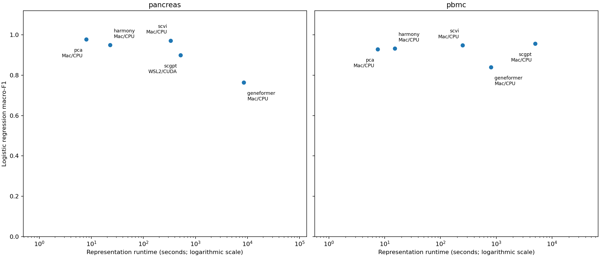

[](https://github.com/Liatir/liatir-app/actions/workflows/ci.yml)

---

# Liatir

Liatir is a local-first desktop environment for bioinformatics, built with Rust,
Tauri 2 and SvelteKit. It brings native tools, locally managed **AI Models**,
`.lia` **Plugins**, visual pipelines and scientific viewers into one application,
with API Connectors, external workflow integrations and a controlled local MCP
interface for connecting other applications.

Local analyses keep working offline once their dependencies are installed.
Workspaces retain inputs, execution logs, results and provenance. Shared types
and input/output contracts live in `packages/liatir-core`.

[Product documentation](https://liatir.com/introduction/overview)
· [Downloads and platform status](https://liatir.com/download)
· [Plugin development](https://liatir.com/plugins/getting-started)

## Scientific Showcases

[Liatir Scientific Showcases](https://liatir.com/showcases/overview) document
scientific questions, methods, measured results and limitations, with technical
packages in [showcases/](showcases/README.md).

### Single-cell foundation models vs established baselines

A completed comparison of pretrained Geneformer and scGPT representations with
PCA, Harmony and scVI on PBMC and Pancreas single-cell data. Ten configurations
completed; two UCE configurations remain blocked with documented causes.

**Observed result:** pretrained models did not show a uniform advantage. scGPT
was competitive on PBMC (logistic macro-F1 0.95685), while PCA and scVI remained
strong on Pancreas (0.97788 and 0.97184; scGPT 0.89987). Macro-F1 measures
cell-type prediction with equal weight per type. This is a two-dataset, one-seed
study; scVI was trained on the evaluation datasets.



*Original validated figure. Pancreas scGPT ran on a PC GPU; the other completed
representations used Mac CPU. These times do not establish a same-host speed
ranking.*

[Read the study](https://liatir.com/showcases/single-cell-foundation-benchmark)
· [Source, results and validation evidence](showcases/single-cell-foundation-benchmark/README.md)
· [Complete reproducibility artifacts and citation: Zenodo DOI](https://doi.org/10.5281/zenodo.23187931)

The source, small results, figures and evidence are tracked here. The complete
approximately 1.8 GB archive is kept outside Git and linked through the Zenodo
record.

## Repository layout

| Path | Purpose |
| --- | --- |
| [packages/liatir-core](packages/liatir-core/) | Shared types and scientific input/output contracts. |
| [src-tauri](src-tauri/) | Native app, bridge commands and process management. |
| [src-ts](src-ts/) | TypeScript bridge and Plugin runtime. |
| [frontend](frontend/) | SvelteKit interface, pipelines, tools and viewers. |
| [runtime-boxes](runtime-boxes/) | Installable runtime definitions, catalog and release evidence. |
| [docs](docs/) | Public product documentation and Scientific Showcases. |
| [showcases](showcases/README.md) | Canonical scientific study packages. |
| [.context](.context/index.md) | Shared architecture, decisions and current project status. |

## Development

Read [AGENTS.md](AGENTS.md) and [.context/index.md](.context/index.md) before
substantial changes. Install Node.js, Rust and the Tauri system prerequisites,
then use the repository scripts:

```sh
npm ci
npm ci --prefix frontend
npm run localdevconf
npm run dev
```

Use `npm run dev:frontend` for the interface alone. `npm run test:fast` runs
unit and contract checks; `npm run test:verify` is the normal completion gate.
Native app changes also require the relevant `npm run test:ui` suites. Heavy AI
tests are explicitly opt-in.

`npm run native-tools:build` prepares the bundled Native Tools for this host;
ordinary development does not build them automatically. See
[AGENTS.md](AGENTS.md) for platform constraints and the complete build/test commands.
Build the public documentation with `npm run docs:build`.

Liatir's application is licensed under [GNU GPL v3](LICENSE).
