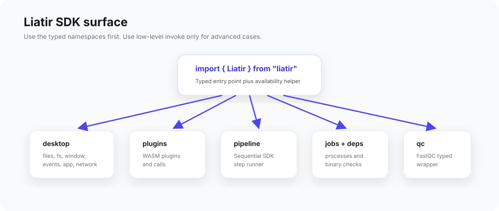

# Liatir SDK

The Liatir SDK has two related surfaces:

- `@liatir/sdk` for Node `.lia` plugin authoring;
- `liatir` for browser/webview code that needs the `window.Liatir` bridge.

Most plugin authors use `@liatir/sdk` through projects created by
`lia init`.



## Node plugin authoring

Node `.lia` plugins import `definePlugin`, `field`, and optional helper types
from `@liatir/sdk`.

```ts
import { definePlugin, field, type PluginContext } from "@liatir/sdk";

const liatirPlugin = definePlugin({
  inputs: {
    text: field.string({
      label: "Text",
      description: "Text to analyze.",
      required: true,
      default: "hello from Liatir",
    }),
  },
  outputs: {
    length: field.number({
      label: "Length",
      description: "Number of characters in the input text.",
      format: "integer",
    }),
  },
});

export default liatirPlugin.main(async ({ input, lia }: PluginContext<typeof liatirPlugin>) => {
  return {
    length: input.text.length,
  };
});
```

The schema is declared once. TypeScript input and output types are inferred from
that schema, and `lia build` generates the `.lia` manifest from it.

## Node plugin bridge

Inside `.main(...)`, the `lia` object is a Node bridge to the running Liatir app.
It is not the same type as `window.Liatir`, because a headless Node process does
not support GUI-only APIs.

Available areas include:

- `lia.jobs`
- `lia.deps`
- `lia.desktop.fs`
- `lia.desktop.files`
- `lia.desktop.events`
- `lia.desktop.app`
- `lia.desktop.network`
- `lia.desktop.clipboard`
- `lia.desktop.notifications`
- `lia.desktop.diagnostics`
- `lia.desktop.globalVariables`
- `lia.align`
- `lia.qc`
- `lia.variants`
- `lia.plugins`
- `lia.sidecar`
- `lia.paths()`
- `lia.invoke`

## Browser/webview bridge

Code running inside Liatir's desktop webview can use the browser bridge:

```ts
import { Liatir, isLiatirAvailable } from "liatir";

if (isLiatirAvailable()) {
  await Liatir.desktop.files.open({ multi: false });
}
```

This package proxies the `window.Liatir` surface. It includes desktop/webview
APIs such as window controls, menus, shortcuts, and other UI-related areas
that are not available to headless Node plugin code.

## API reference

- [Plugin authoring API](/plugins/api/plugin/define-plugin)
- [field builders](/plugins/api/plugin/field)
- [PluginContext](/plugins/api/plugin/plugin-context)
- [lia Node bridge](/plugins/api/plugin/lia-context)
- [Root browser API](/plugins/api/root/overview)
- [Desktop API](/plugins/api/desktop/app)
- [Plugins API](/plugins/api/plugins/call)
- [Pipeline API](/plugins/api/pipeline/run)
- [Jobs API](/plugins/api/jobs/spawn)
- [Dependencies API](/plugins/api/deps/check)
- [QC API](/plugins/api/qc/fastqc)
